# A5 python SDK


# 00硬件设备连接

## 单臂设备

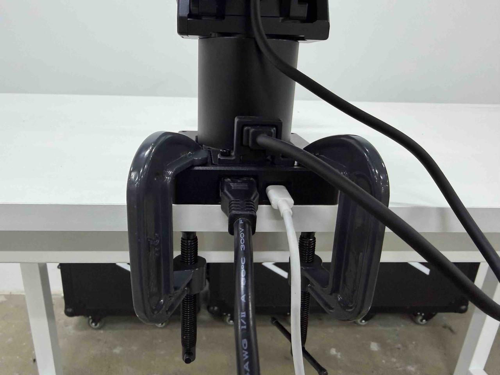

## 桌面设备

通过G型夹，将平台两侧固定。

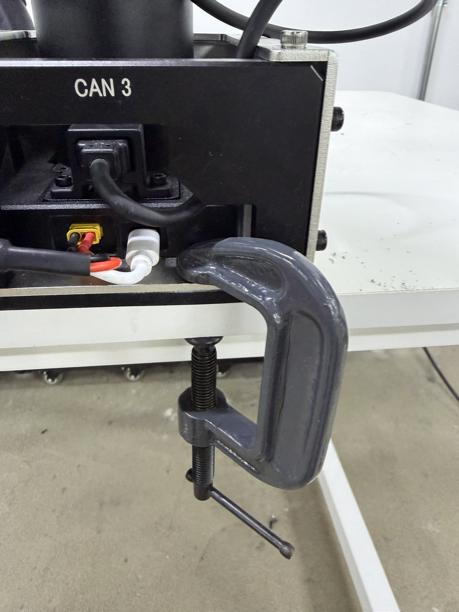

## 单臂介绍

每台机械臂底座有两个接口，分别为电源以及信号。

XT30为24V电源接入。

Type\-C接口为CAN信号接口。

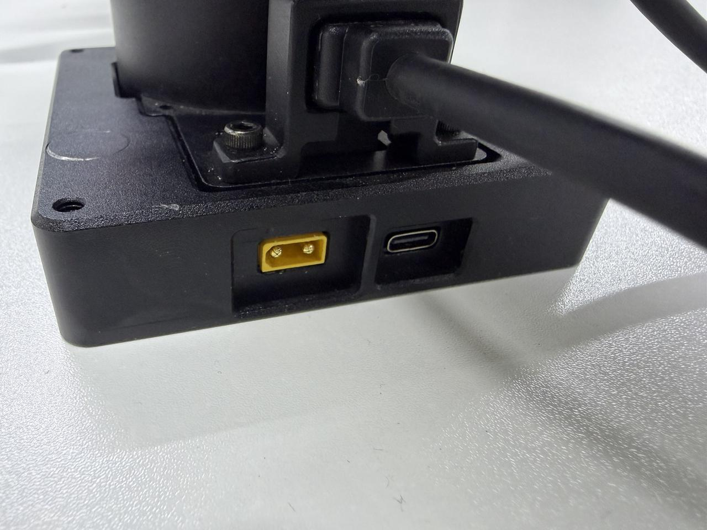

每台机械臂底座含有一块CAN信号板，根据CAN设备ID进行区分

设备ID设定如下建议，设置时参考单臂手册进行设置。


| 左臂       | CAN1 |
| ---------- | ---- |
| 右臂       | CAN3 |
| 头部机械臂 | CAN0 |

## 桌面接口

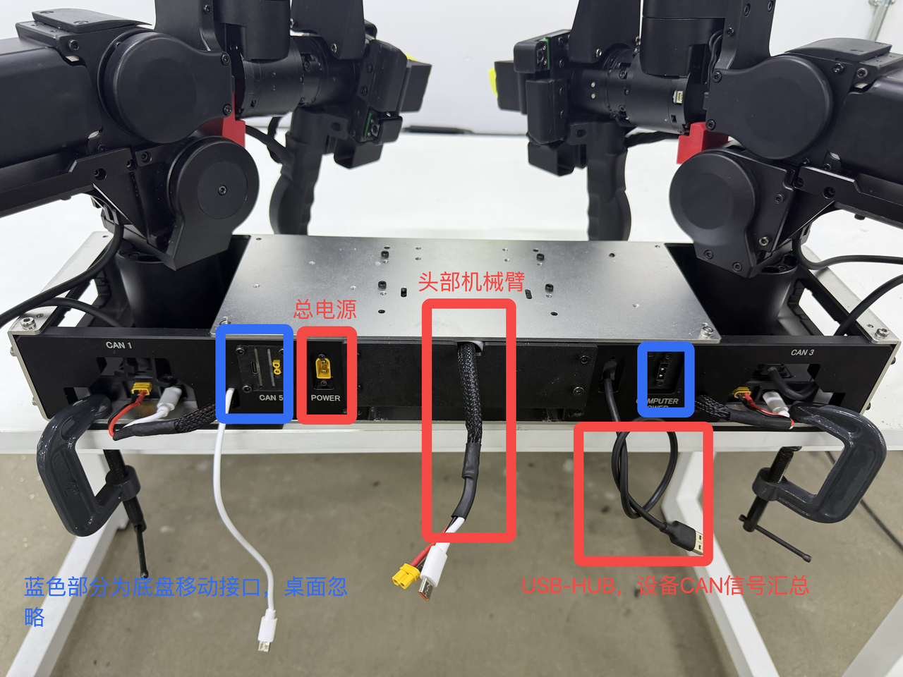

# 00环境配置

A5/tools/

```Plain
./01_global_nopasswd_sudo.sh.x
./02install.x
./03_install_common_packages.sh.x 
```

# A配置CAN设备

设备如未更改，只需配置一次即可

## 单臂CAN ID设置

设备如未更改，只需配置一次即可

A5/ARX\_CAN/

```Plain
./search
```

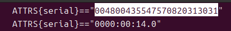

拷贝到 arx\_can\.rulels,并保存

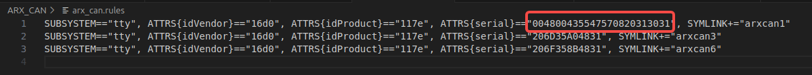

```Plain
./set
```

开启对应CANID

```Plain
./arx_can1
```

## 多机CAN ID 设置

参考单臂配置文档进行设置。
通过拔插单臂底座type\-c接头，保证仅有目标CAN设备在线，从而进行操作。

以右臂为例，目标CAN ID 为CAN3，仅保证CAN3设备在线，左侧CAN1拔出。进行 search，更改can\_rules,set等操作。

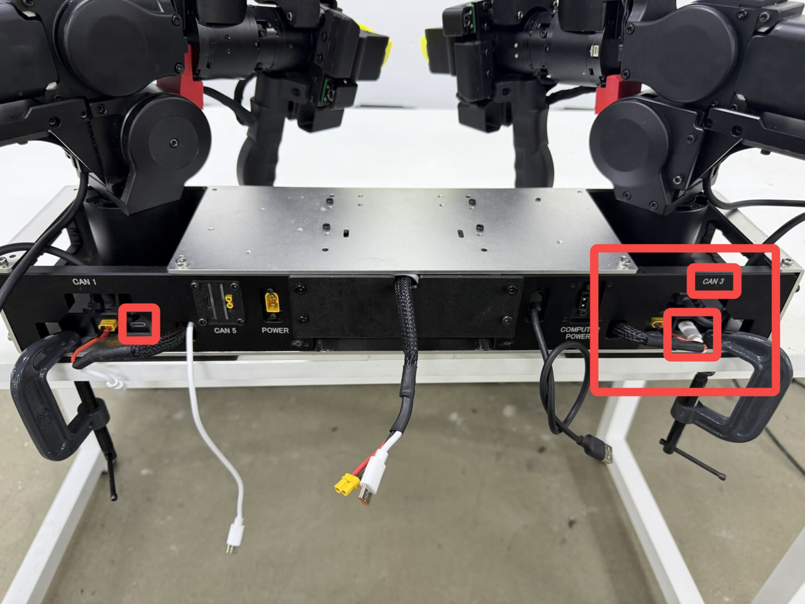

多个CAN设备同时存在，可以复制整行，确保序列号与对应CAN ID符合即可。

⚠️确保每个CAN ID 仅有一个出现，同一can\_rules不能有两个相同设备。


# B编译

A5/

```Plain
./build.sh
```

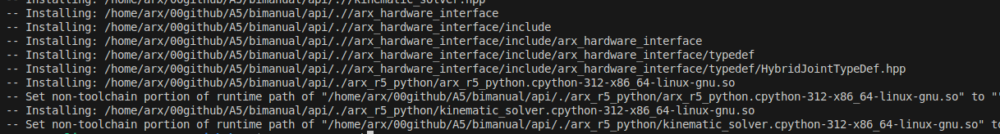

# C运行

A5/

```Plain
source ./setup.sh
python3 test_single_arm.py
```

# SDK

## 0\>夹爪控制

set\_gripper\_pos\(\)  //0,\-3\.14

## 1\>姿态控制

set\_ee\_pose\(pos,quat\)

set\_ee\_pose\_xyzrpy\(xyzrpy\)

## 2\>关节位置控制（底层重力补偿）

set\_joint\_positions\(positions\)

## 3\>电机MIT协议控制 （kp, kd, pos, vel, torque）

mit\_joint\_control\(id,kp,kd,pos,vel,torque\)

## 4\>状态反馈

关节反馈（位置，速度，扭矩）\+姿态反馈

### 4\.1 关节位置反馈

get\_joint\_positions\(\)

### 4\.2 关节速度反馈

get\_joint\_velocities\(\)

### 4\.3 关节扭矩反馈

get\_joint\_currents\(\)

### 4\.4 末端位姿反馈

get\_ee\_pose\(\) 四元数形式

get\_ee\_pose\_xyzrpy\(\) 欧拉角形式

## 5\>重力补偿

gravity\_compensation\(\)

## 6\>根据关节位置，解算出姿态

forward\_kinematics\(\)

## 7\>更改末端质量

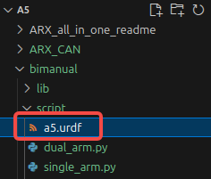

Change link6 mass

Remember to save

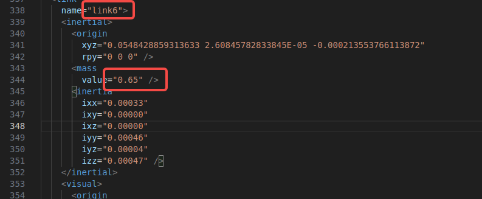

## 8\>校准命令

非必要不要校准

将机械臂摆放到下图位置执行A5\_cali\.sh   joint6需要水平单独校准

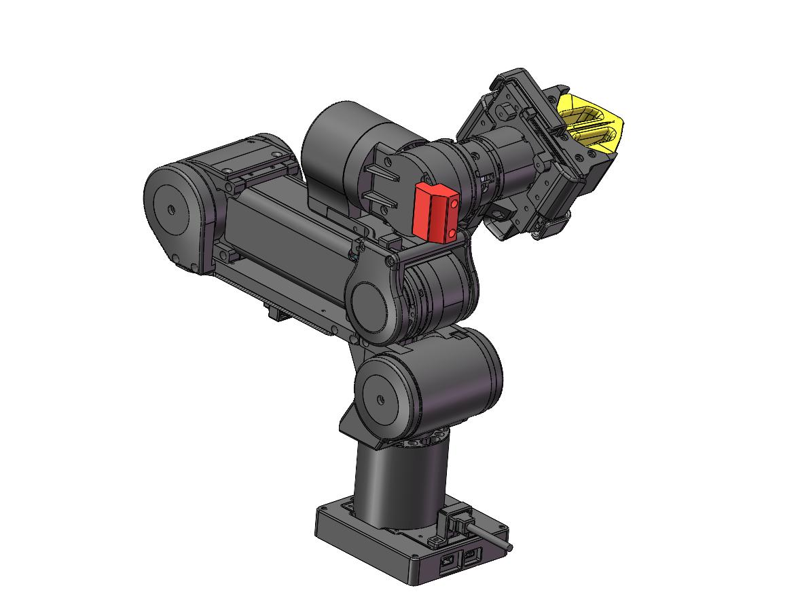

A5/ARX\_CAN/

非必要不要校准

校准仅在CAN1时生效，需将校准的臂设置为CAN1，校准结束后再进行修改

```Plain
//cali joint1-5
./J1-5cali
//cali joint6
./J6cali
```


|         | CANID |
| ------- | ----- |
| Joint1  | 1     |
| Joint2  | 2     |
| Joint3  | 4     |
| Joint4  | 5     |
| Joint5  | 6     |
| Joint6  | 7     |
| gripper | 8     |

# **关节坐标**

右手系

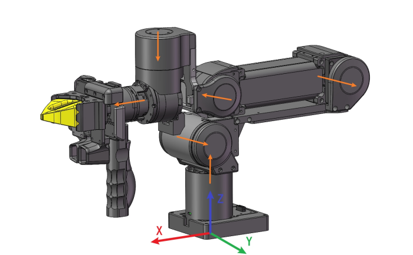

# **机械臂末端姿态坐标**

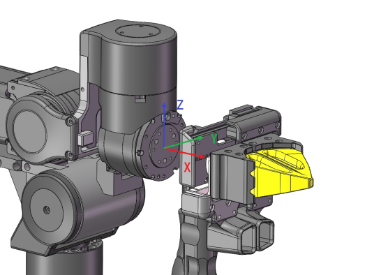
